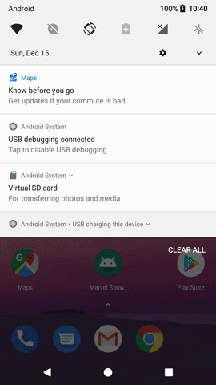

Modularized Clean Code Marvel Showcase
=

[](https://circleci.com/gh/MayconCardoso/Modularized-Marvel-Showcase/tree/master) [](https://codecov.io/gh/MayconCardoso/Modularized-Marvel-Showcase) 

This is a simple [Marvel](https://developer.marvel.com/) Single Activity application show case. It has been structured in a multi-module fashion, with semantics guided by Clean Architecture; this means that high-level modules don't know anything about low-level ones.

In order to avoid writing architecture boilerplate I have used one of my personal libraries: [ArchitectureBoilerplateGenerator](https://github.com/MayconCardoso/ArchitectureBoilerplateGenerator)

## Setup
- Create an account on [Marvel Developer Console](https://developer.marvel.com/)
- On your ```local.properties``` file, create these two variables and fill it up with your marvel api credentions.

```
publicKey = "YOUR_PUBLIC_KEY"
privateKey = "YOUR_PRIVATE_KEY"
```

## Demo

 

# Libraries

Here you can check out the [dependencies file.](https://github.com/MayconCardoso/Modularized-Marvel-Showcase/blob/master/build-dependencies.gradle) But basically these are the libraries used in this example:

- [Koin](https://insert-koin.io/)
- [Navigation Component](https://developer.android.com/guide/navigation/)
- [LifeCycle](https://developer.android.com/topic/libraries/architecture/lifecycle)
- [LiveData](https://developer.android.com/topic/libraries/architecture/livedata)
- [ViewModel](https://developer.android.com/topic/libraries/architecture/viewmodel)
- [Retrofit](https://github.com/square/retrofit)
- [Picasso](https://github.com/square/picasso)
